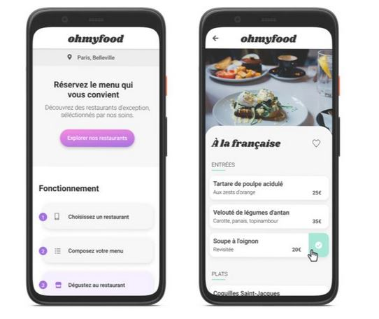

## Présentation du projet 3 : 

#Présentation du projet 3 - Ohmyfood 

Dynamiser une page web avec des animations CSS
Configuration HTML et CSS d'après la maquette mobile fournie (mobile first)
Utilisation de SASS
Versionnage sous Github
réalisation des versions 'responsive'
Hebergement du projet sous Github

# Compétences évaluées 

Mettre en œuvre des effets CSS graphiques avancés
Assurer la cohérence graphique d'un site web
Mettre en place son environnement Front-End
Mettre en place une structure de navigation pour un site web
Utiliser un système de gestion de versions pour le suivi du projet et son hébergement

